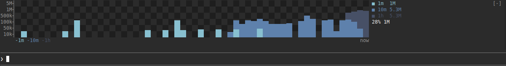

# cc-metrics

Live token usage for the current session (including subagents), drawn above the prompt.



## Installation

### Install

```
claude plugin marketplace add Occy88/claude-code-metrics && claude plugin install cc-metrics@cc-metrics
```

### Uninstall

```
claude plugin uninstall cc-metrics@cc-metrics && claude plugin marketplace remove cc-metrics
```

## Usage

`/metrics` toggles the chart.
